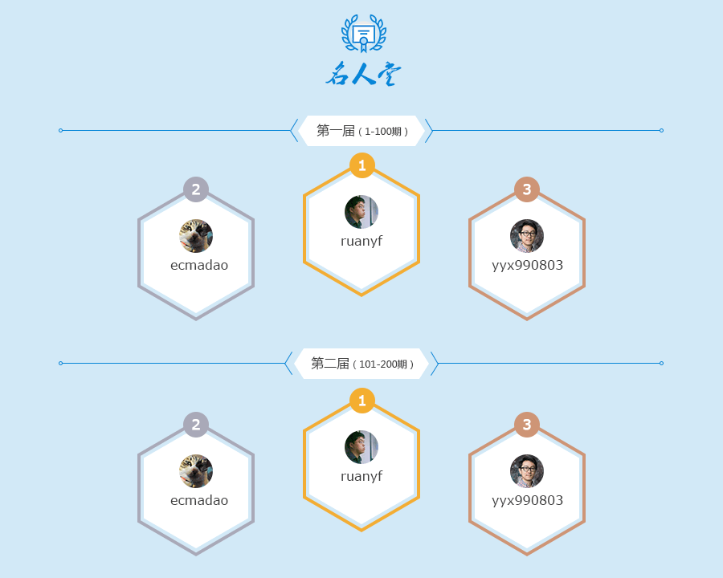

# 关于前端晚练课

## 简介

前端晚练课是 `前端早读课` 的姊妹篇，与其交相呼应，朝读晚练，主要以群体参与代码练习这种集体行动为开展方式，通过群体氛围感染成员积极参与，通过多成员练习同一个题目来互相学习、取长补短，通过这种长期的刻意训练来达到提升个人前端技术水平的目的。

## 愿景

1. 以码会友，互动交流，活跃粉丝群气氛，增进成员间的了解；
2. 技术学习，互勉互励，形成浓郁的技术学习氛围；
3. 拓展视野，增长见识，学习别人对同一问题的不同思路；
4. 日积月累，厚积薄发，通过长期的刻意训练，提升自身的前端技术水平。

## 时间

- 每天晚上 **8:00** 左右出题，次日同一时间或其前后 1 个小时公布答案；
- 遇法定节假日晚练课停更，按国家假期安排放假。

## 角色

- 管理员：负责本仓库（以下简称“仓库”）的维护工作；
- 考官：每期（每天）出题的人，通过报名产生，考官按报名顺序轮流参与每期出题；
- 试炼者：参与每期（每天）答题的人，自愿参与。

## 参与方式

1. 考官报名登记（在群里报名），形成考官轮值表，由管理员更新名单到仓库，每次最多 10 人；
2. 当天轮值考官晚上约定时间在仓库上发布一个 issue 来布置当期练习题；

  > 标题格式：`第 [n] 期([日期])：[标题名称]`  
  > 示例：第 1 期(2019-04-29)：求两个数组的交集
  >
  > 练习题可以是面试问答题（非技术题也行）、算法题、开放题等

3. 参与者在对应的 issue 中以评论形式提交答案；

  > 注：当期考官不能参与当期回答

4. 详细规范参见：[第 0 期(2019-05-07)：答题规范](https://github.com/fezaoduke/fe-practice-hard/issues/1)

4. 次日，上一位轮值考官需在约定时间前后 1 个小时左右，在自己发的 issue 中公布答案或解题思路，同时选出优秀回答者 1~2 名；
5. 当日的考官则继续准点发布新的 issue 布置当期的练习题；
6. 按考官轮值表上的顺序，重复 2 ~ 5 的步骤，每满 10 期进行下一轮的考官报名。

## 激励措施

- 量化指标

  > 注：量化指标数据每天统计一次，只以当天的统计数据为准。

	1. 参与人数：参与人数越多，说明当期考官的练习题越有吸引力；
	2. 练习题点赞数：试炼者可对练习题点赞，点赞数越多，说明当期的练习题越有价值；
	3. 优秀回答者：由当期出题的考官根据答题质量评选而出；
	4. 回答点赞数：试炼者可对他人的优秀回答点赞，点赞数越多，说明回答得越精彩。

- 等级天梯

  > 下文的设计图仅供参考，实际界面可能会有所不同，以最终网页为准。 
  > 图中人物、头像来自 GitHub，侵删。

	1. 试炼者排行榜：根据所有试炼者累计获得的“优秀回答者”次数和回答点赞数排行；

    

	2. 金牌考官：每 100 期为一个计分周期，评选出在当前计分周期中累计获得“练习题点赞数”最多的前 3 名考官，荣获金牌考官（记录在仓库文档中），并获礼品奖励；

    

	3. 名人堂：每 100 期为一个计分周期，评选出在当前计分周期中累计获得“优秀回答者”次数最多的前 3 名试炼者，荣登名人堂（记录在仓库文档中），并获礼品奖励。

    

## 常见问题

1. 报名的考官人数不足 10 人怎么办？

	> 从头重复。例如当前考官报名人数为 5 人，到第 6 期时，这 5 人再从头轮值一次（根据前文的激励措施，轮值次数越多，对考官越有利）；也可接受中途报名，但需提前一天知会管理员。

2. 当期的考官到约定时间没有发布练习题怎么办？

	> 超过约定时间半小时仍未发布练习题的，由管理员接手发布本期练习题，同时会登记当期考官的缺勤次数，缺勤次数会影响对“金牌考官”的评选。

3. GitHub 如发生不可预知的异常情况而无法组织活动时怎么办？

	> 暂停当期的活动，等待 GitHub 恢复正常。

4. 当期参加的试炼者人数为 0 怎办？

  > 考官照常公布答案。
